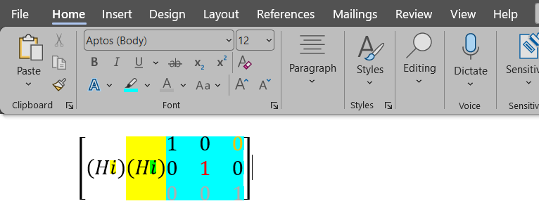
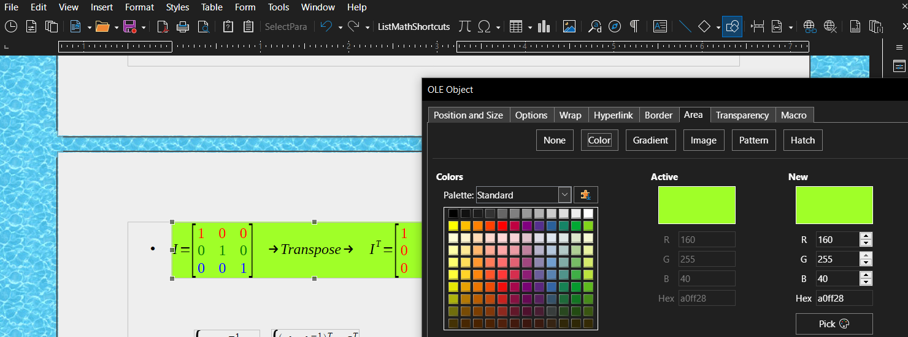
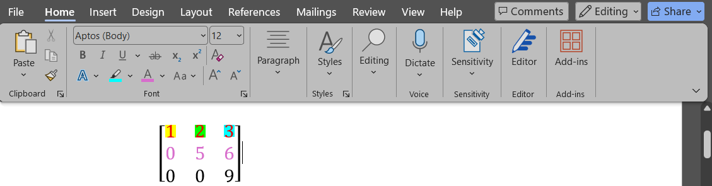
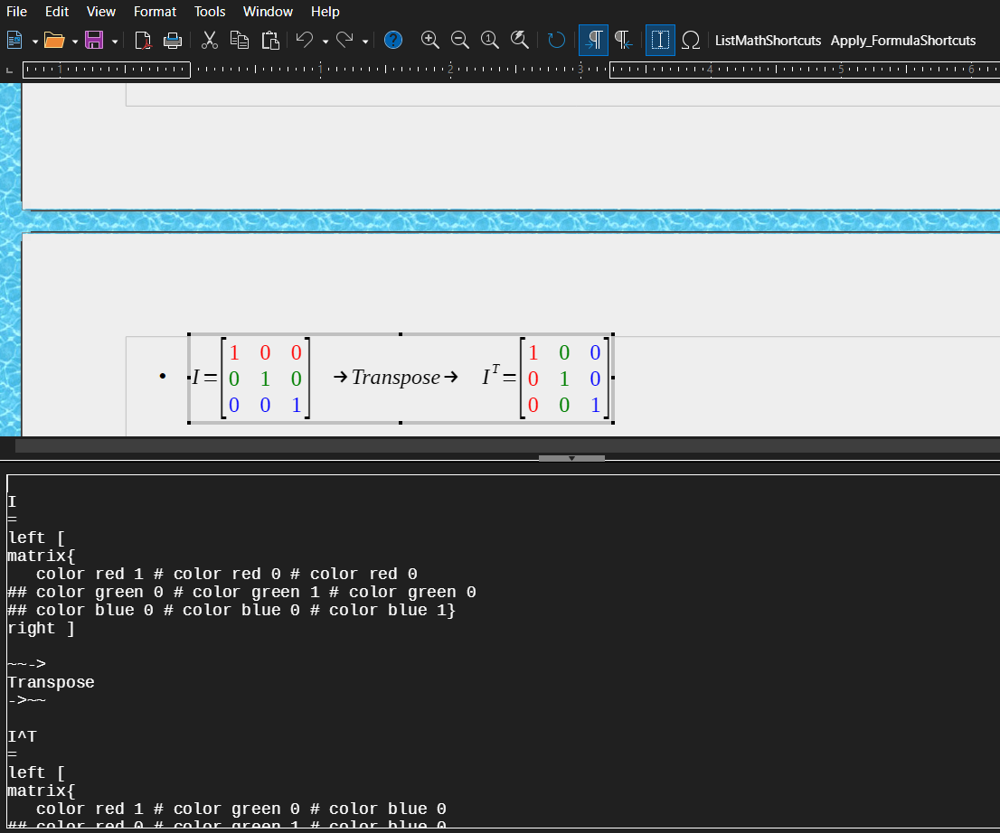
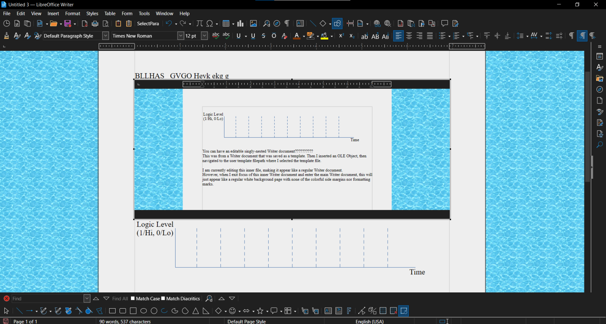
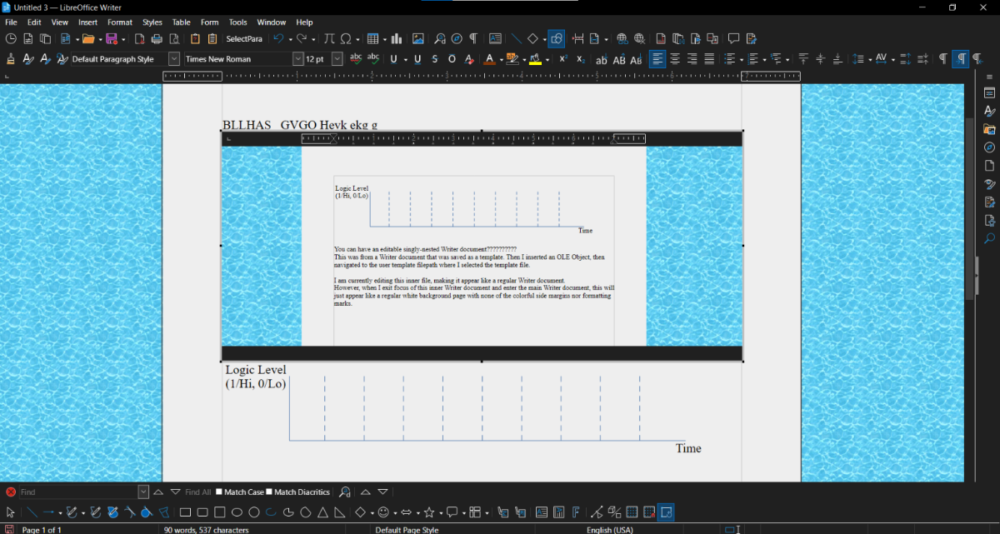

# I'm looking for how to add shortcuts to ***Microsoft Word***, not *LibreOffice Writer*.  How do I add a Math shortcut to *MS Word*?
<br>
<br>

## How to GET TO the place to add/modify/delete `Math AutoCorrect` shortcuts *in MS Word*  
* On MS Word's toolbar (at top), go to the `Insert` tab, then find the `Symbols` section label that has `Equation` inside it.  
* Click on `Equation`, displaying/creating a new toolbar tab (colored blue-ish instead of the default gray color) that says `Equation`. Click on this new toolbar tab.  
* In the `Equations` toolbar tab, find the section labeled `Conversions`, and in the lower-right side of that section, click the arrow that's inside a very small square box.  
  * If you instead hover over the boxed arrow (*before* clicking it), this small button displays the tooltip `Equation Options`.  
* Now inside the `Equation Options` popup dialog box, there is a very-thinly-outlined (almost unnoticeable) top section and a bottom section. Inside the top section/"box", there is a somewhat large `Math Autocorrect` button. Click that button. This will open up *another* (total of 2) dialog box, where the whole dialog box is labeled `AutoCorrect` and you're automatically put inside the `Math AutoCorrect` tab *inside* the newest dialog box.  
* Now you can go wild adding whatever substitutions you want!  
  * Well, ... . See sections below.  
    * (you can add substitutions for equations/formulas as long as they obey Word's weird Equation formatting and syntax, like using `&` and `@` for matrix spacers for rows and columns respectively, and using spacebar characters to tell *Word* *"please convert the characters that come BEFORE this space into an object, factoring in however I used the "left-side-ends signifier/marker" symbol (├) and "right-side-ends signifier/marker" symbol (┤) to group math objects in the correct nesting order."*)  

### TL;DR
Word -> Toolbar -> `Insert` tab -> `Symbols`/`Equation` button -> `Equation` tab -> `Conversions`/Small box in corner with arrow inside -> New popup/dialog box -> `Math AutoCorrect` button -> New popup/dialog box -> Enter your substitution rules here.
<br>
<br>

## How to MODIFY the `Math AutoCorrect` shortcuts *in MS Word*  
* You might need to copy-paste some special characters you find online (like in this README!)...  
* Example: I want to make a shortcut for a column vector that has 6 slots:  
  * `Replace`: `\col6`, `With`: `■(&&&&&) `  
    * Note the presence of the trailing space!!!!  
    * The trailing space allows Math object formation to happen in a certain ordered manner, so it's absolutely necessary, at least if you don't want the user to *have to* physically press the spacebar key each time (and also press it in exactly the right location inside the equation...) they use the `\col6` substitution.  
  * `Replace`: `\editableMatrixObject`, `With`: `■()`  
  * `Replace`: `\mat1`, `With`: `■() `  
    * Note the trailing space! This turns the Word "math code" into an actual rendered matrix object.  
  * `Replace`: `\qhmat`, `With`: `1/√2 (■(1&1@1&-1)) ` (Quantum - Hadamard matrix `H`)  
  * `Replace`: `\q+`, `With`: `\qplus `  
    * The space character afterward tells *Word* "hey, apply a substitution if you happen to find one"  
  * `Replace`: `\qp`, `With`: `\qplus `  
  * `Replace`: `\qplus`, `With`: ` 1/√2 (├|0〉+├|1〉) `  (Quantum - Ket "Plus" `|+〉`)  
    * Note the multiple spaces at the right-end of ***each*** Math object.  
    * Without the left-side-ends-here signals, Word would continue trying to include the leftmost parenthese into the Objects, which is undesirable in this case.  
  * `Replace`: `\qsuperposition3`, `With`: `1/√(2^(3)) (├|000⟩ +├|001⟩ +├|010⟩ +├|011⟩ +├|100⟩ +├|101⟩ +├|110⟩ +├|111⟩ ) `  
<br>

## More resources for *MS Word*'s `Math AutoCorrect` tool  

### Where (on GitHub) is your list of *MS Word* `Math AutoCorrect` shortcuts?
I *might* eventually create an accompanying file that lists most of my *MS Word* Math shortcuts, but good luck copying and pasting them into your own Word environment...
* That's a significant part of the reason I switched over from `Word` to `LibreOffice` (as a whole).  
* I can't back up nor share (en masse/"all at once") those shortcuts with other people, and I'm screwed if I lose access to my MS account for whatever reason (like getting locked out of my MS profile). Word uses a binary format that I don't know how to parse, and apparently other people (according to forums I've looked at) haven't figured out how to parse it either.  
  That format *may(?)* also be proprietary, so there *may* be some legal concerns around publishing how to parse the stored equations (which would be an *extremely* stupid thing for MS to sue over, unless they're covering up something else that is somehow associated to the format in which they store this equation data).  

### Helpful Links
* [Quick start guide to Math AutoCorrect commands and symbols  -  Microsoft Support](https://support.microsoft.com/en-us/office/quick-start-guide-to-math-autocorrect-commands-and-symbols-9cbc8873-c217-4c87-a059-03d539ef8eea)
  * [Quick start guide to Math AutoCorrect commands and symbols  -  Microsoft Support](https://support.microsoft.com/en-us/office/quick-start-guide-to-math-autocorrect-commands-and-symbols-9cbc8873-c217-4c87-a059-03d539ef8eea#bkmk_turnonsettings)
    * Massive list of all pre-made Math symbols in *Word*, their equation commands to get them, their unicode representations, and their visual description of the symbol
  * [List of Commonly Used Math AutoCorrect Entries in Word 365  -  daisy](https://daisy.github.io/math-a11y/docs/ms-math/List-of-Commonly-Used-Math-AutoCorrect-Entries-in-Word-365.html)
    * More useful than above link (from MS) in my opinion.
    * Contains non-default MS Word Math symbols that you can create.  

### Helpful Info - Creating Rules That Contain Nested Objects/Rules
* Avoid the urge to use grouping operators `()`, `[]`, `{}` when creating `Math AutoCorrect` **parseable** formulas in both `Word` and \*`Writer`.
  * Here are the intended (and therefore *reliable*) grouping operators in:
    * `MS Word:` `├` and `┤ `  
    * `LO Writer:` ` left<?>` and ` right<?>`  
  * E.g., don't expect `Replace`: `(((1/(\sqrt (2)) )/1/x^2)) ` to work correctly when relying on *Word*'s `Math AutoCorrect` rather than manually typing it out. You'll need to assign (almost) every grouping-related character either an adjacent space/` ` character or an adjacent "leftmost-part-ends-here signal"/`├` character.
  * \*<sub> Well, `{}` ***is*** actually the correct thing to use in *Writer* for functions' parameters/inputs (e.g., `frac{topText}{bottomText}`), but ***not*** for parsing the correct nesting order of objects.  
    This project is concerned with the latter and not the former, so the original statement is still true.</sub>  
* You *shouldn't* ever need to use (specifically) `┤ `, but if you find a scenario that *requires* it, please let me know!  
  * You'll always either be 1) using `├` or 2) relying on typical grouping operators like parentheses and/or brackets.  
* When the parser tries to group an opening symbol (like any of the following: `({[├`  ) and closing symbol (like `)}]┤`  ) together, the parser "looks" from right to left until it finds a corresponding symbol (it looks for an opening symbol like `[` if it starts on a closing symbol like `)`), so the parser matches the first "Open,Close" symbol ***pair*** that it finds, turning that *pair* into a single object.  

### How do I chain multiple *Word* `Math AutoCorrect` rules together, like `\specificShortcut1` and `\specificShortcut2` both becoming `\sink_mainShortcutToUse`, which then becomes `x+y-z`?
```
Example that's written out as a flowchart:

\qp   \q+  \qplus  \quantum_plus    (Rules 1 through 4, whose output is directly below)
  |     |      |        |
  \___  | _____/________/
      \ /
       V
\quantum_ket_plus                    (Rule 5, whose output is directly below)
     |
     V
1/√2(|0〉+|1〉)
```

That's the neat part! You don't!  
<sub>You can't.</sub>  

The closest you can get to chaining multiple `Math AutoCorrect` rules together ***in Word*** is by using spacebar characters ***inside a single rule***.  
* E.g., `1/√2 (■(1&1@1&-1)) `  
  * Notice how the square root ***symbol*** is there rather than the `\sqrt ` shortcut rule.  
    * `\sqrt ` has a space character at the end in an attempt to apply the rule (i.e., to perform the substitution), but it won't work since it's inside another rule.  
  * That ***symbol*** (rather than the ***rule*** that creates that symbol) ***absolutely MUST*** be there due to the same "no chaining of rules" issue.  

**This project/macro (`MathFormulaExpander`) does *not* have this "no chaining of rules" limitation** since this project's rule parsing is not completely "flat" (i.e., *is* at least somewhat hierarchical).  
* This non-limitation is due to this project's reliance on *sequential* (non-parallel) calls to perform RegEx substitution (at the cost of <sub>unnoticeably</sub> slower substitutions), rather than using a hashtable/global LUT (Lookup Table) of each rule *along with a guarantee that all rules in the rule database are mutually exclusive/deterministic-when-substituting/non-conflicting*.
  * Note: Though **the set of all *calls*** to a RegEx replace function (in this project) occurs sequentially, **each individual/standalone rule (i.e., RegEx replacement)** can still be allowed to compute (i.e., search and replace) in parallel, <sub>which is likely ***only*** beneficial for ***very large*** substitution searches/inputs ***(that happen within a single rule)***.</sub>
    * However, this project uses the default `LO Basic` RegEx library functions, so whether or not each individual RegEx action is performed in parallel is up to the `LO Basic` programming language, not to some specialized implementation done by this project.
<br>
<br>


### Are there any equation-related drawbacks to replacing *MS Word* with *LO Math*?
Yes.  

The problem is that LO Math is incapable of applying a highlighter-style background to Formula text, where MS Word does not have this problem.  

Additionally, that drawback *cannot* be fixed by a user without creating a new macro/extension/fork to LibreOffice.  

In both LO Writer (note: *not* LO Math\*) and MS Word, **highlight** can be applied to the *entire* object (i.e., not just individual entries).  
* \*`not LO Math`: This is due to a Math OLE Object not being aware that it is embedded inside a Writer document, and therefore highlighting its \[i.e., the Math Object's\] background is *not* an option.  
  The background highlighting functionality is a capability of *LO Writer*; **LO Math lacks this highlighting capability.**  
* 
* 


However, for *individual* entries, LO Math and MS Word equations differ in capability:

* MS Word can **highlight** individual entries of a matrix *and* **color** individual entries in that matrix.  
  * 
* LO Math can only **color** individual entries in a matrix. **Highlighting individual entries is not supported in LO Math.**
  *   

**I have not found a workaround in *LO Math* nor *LO Writer* for allowing per-element *highlighting* (not just background highlighting).**  
If there exists an ability to support arbitrarily-deep nested OLE objects (and assuming that all types of OLE objects can be embedded in all other types of OLE objects), then one could have a Writer document with a Math OLE object (main/overall equation) with multiple Writer documents embedded (on a sibling-level, not further/recursively nested) inside the Math object, and each embedded Writer doc can have a single Math OLE object inside, which you can then color the background of each when inside the embedded Writer above it  - acting as a highlight.
* Diagram of nesting:
```
           [Main Writer Doc]
                  |
// Will house all elements belonging to what we can treat as a single Formula object.
// This specific level isn't truly necessary, but it does keep the main Writer doc tidier.
          [Inner WriterDoc/MathObj]
                  |
          _______/|\_______
         /        |        \
// Treat as single Math element, like one element of a matrix.
// Having three nested-at-depth-2 Writer documents means we can have a matrix with 3 elements that are each highlightable and colorable.
     /            |            \
[WriterDoc]  [WriterDoc]  [WriterDoc]  // Can set bkgd highlight of each element here, but not text color.
    |            |             |
 [MathObj]    [MathObj]    [MathObj]  // Can set text color of each element here, but not bkgd highlight.
```
* However, after testing it, I discovered two things:
  * A LO Writer document that contains a Math OLE object ***cannot*** have another Writer document inside that Math OLE object. I.e., `WriterDoc->MathObj->WriterDoc` is illegal due to the innermost part. There is no existing way to insert a LO Writer document inside *any* Math OLE Object, even when going to `Customization` and altering the toolbar's list of available/selectable commands. The `Insert OLE Object` command simply does not exist when inside even a standalone `LO Math` application window.
  * A LO Writer document *can* contain an embedded LO Writer document, but that inner LO Writer document ***cannot*** have another Writer document inside it. I.e., `WriterDoc->WriterDoc->WriterDoc` is illegal due to the innermost part.
  * 
  * Curiously though, the inner Writer document is editable.
    * Steps to create an inner document: First, save a LO Writer document (that you want to embed in another doc) as a template. Second, open a new LO Writer document, then Toolbar->`Insert`->`OLE Object`->`OLE Object...`->`Create from file`->`Search`->Navigate to the previously saved template (if you can't find it, then check for it inside `C:\Users\<YOUR-COMPUTER-USERNAME>\AppData\Roaming\LibreOffice\4\user\template`) and double-click it to embed it into the already-open Writer document -> Ensure the boxes named `Link to file` and `Display as icon` are unchecked -> Click `OK`.
    * 
    * 
<br>
<br>


