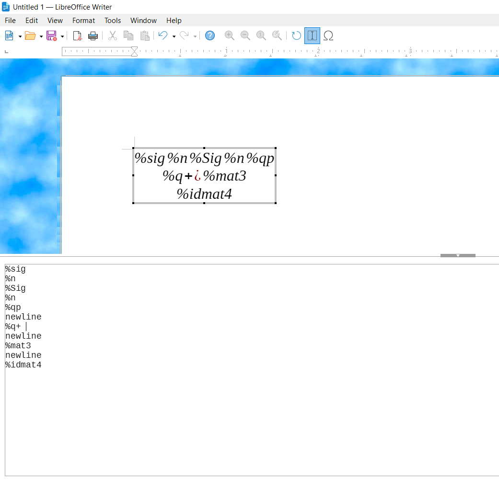
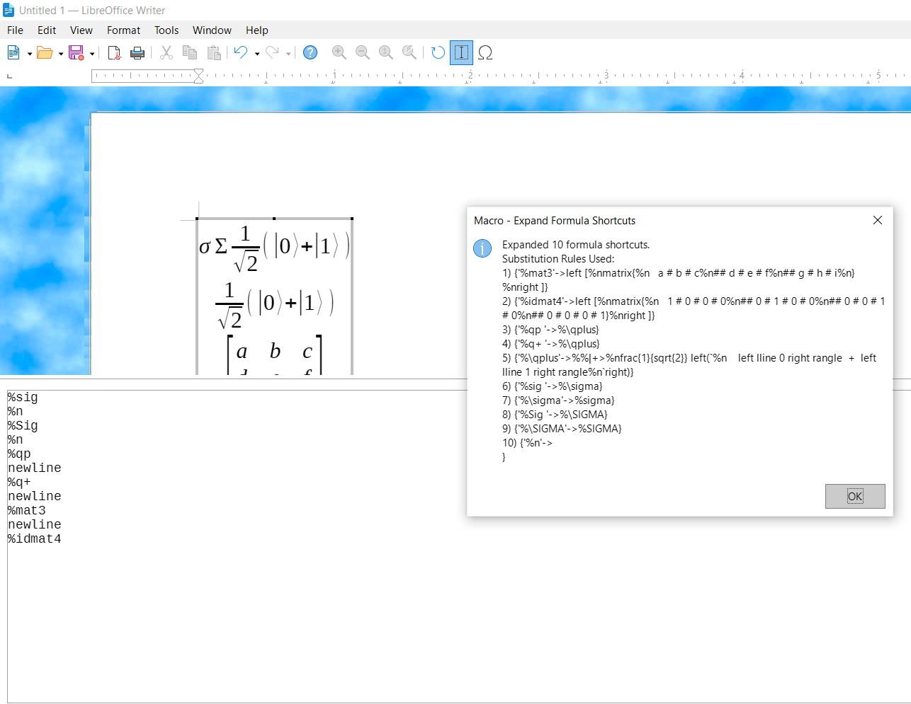
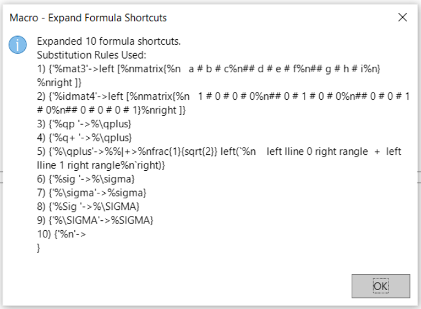

# Example of MathAutoCorrect in action

Before substituting key phrases:

<br>

During substitution of key phrases

<br>

After substituting key phrases

<br>
<br>

# Purpose of MathAutoCorrect

AutoCorrect doesn't exist when inside LibreOffice Math Formula Objects, so there is no
possibility of unofficial LO shortcuts (at least, if you do not want to have to arduously
click through the GUI to get to your user-defined formulas).
This is especially annoying with long equations.

<br>

Also, if you forget certain patterns that LO Writer already uses, this macro lets
you simply write down the shortcut to some pre-defined rule, like `%idmat2`, that contains
the native LO Writer Math Formula pattern. Example native LO Writer Math Formula patterns:
* `left [` SomeContents `right ]`
* `left [` SomeContents `right none`
* `stack{` SomeContents `}`
* `matrix{ My_row1col1 # My_row1col2 ## My_row2 }`

<br>

This macro code lets you substitute keyphrases into their expanded form when the user is
inside (not merely selecting) the Math Formula Box Editor inside a LibreOffice Writer file, 
like converting (i.e., substituting)
* `%al ` into `%alpha`
* `%the ` into `%theta`
* `%sig ` into `%sigma`
* `%Sig ` into `%SIGMA`
* `%irt2` into `frac{1}{sqrt{2}}` (for "Inverse squareRooT of 2")
* `%mat2` into 
  ```
  left [
  matrix{
     a # b
  ## c # d
  }
  right ]
  ```
* `%idmat4` into
  ```
  left [
  matrix{
     1 # 0 # 0 # 0
  ## 0 # 1 # 0 # 0
  ## 0 # 0 # 1 # 0
  ## 0 # 0 # 0 # 1}
  right ]
  ```
* `%cases2` or `%piecewise2` or `%pw2` into
  ```
  left {
    stack{a, x>0 # b, x <= 0}
  right none
  ```
* `%cases4` or `%piecewise4` or `%pw4` into
  ```
  size*0{ phantom{Piecewise Function 4} }
  stack{%theta`=` # ` # `}
  size *3.75{\lbrace}
    stack{
      {x,```i>0}
    # {y,```i=0}
    # {z,```i<0}
    # {%alpha,`i notin setR}
    # {size *2.5{~}}
    }``````
  ```
* `%deriv` into `{{df} over {dx}}`
* Many more substitutions that have already been implemented.


## File Details
⭐✅ `MathFormulaExpander.vb`
* *The* file that contains:
  * The macro to run (**"Main_ExpandFormulaShortcuts"**)
    * Should only be run after you're ***inside*** a Formula Editor.
  * The macro that details a list of available substitutions (**"ListAvailableShortcuts"**)
    * Can be run either inside the main Writer document or inside the Formula Editor.
* This is the file where you should add new rules (or modify old ones) to your liking.
* This file also includes an extra macro (**"Main_ExpandFormulaShortcutsQuiet"**) that does the exact same set of
  substitutions, but *doesn't* create a popup box informing you of the text replacements that it used, which is very
  useful once you get acquainted with how the rule-substitution system works.

❔ `MathFormulaExpander_ShortcutsTestbench.txt`
* A file that *should* (not "does", but "should") contain all the substitution
  rules that you can copy into a Formula Editor, then run the substitution macro to look for any
  unintended changes that would indicate you need to change the position or input string of a
  substitution rule.
* It is currently not fully correct, and is missing many, many tests, as is indicated inside the file itself.
* It could be useful to you, but in its current state, the idea behind the file would be far more useful to you than the file.

💤❌ `MathFormulaExpander - GetFormulaObject_Experimenting.vb` 
* Purely a development (WIP) file that contains attempts to allow substitution when the user's cursor has selected but not entered a math formula. 
  All attempts so far have been unsuccessful.
  * *Unless you are extending/improving this repository in some way* (or are a LibreOffice "employee" trying
    to see where people struggle when trying to improve LibreOffice code), ***this specific file will not be useful to you.***
<br>

# Notes
This *does not* substitute the visual-only representation of the Math Formula.  
It substitutes the *actual text* inside the Math Formula (which then alters the visual representation).

## Preferences: Modifying rules to obtain single-char symbol
If desired, the LO-Writer-autorecognized constants like `%SIGMA` and `%sigma` can be replaced with the
actual single-character symbols (e.g., `α`, `β`, `δ`, `Ψ`, `ψ`) by modifying this macro.

You can copy the actual unicode symbols online (or even from within Writer via the Symbols section) and either:
  * Replace the output part of the existing "sink"/"absorption"/"pointer" rules (e.g., `"%\rawtext"`, `"%\comment"`, `"%\gamma"`, `"%\qminus"`) with the desired single-character symbols.
     * E.g., changing `ReplaceShortcut(sNewFormula, "%\delta", "%delta", ...)` to `ReplaceShortcut(sNewFormula, "%\delta", "δ", ...)`).
  * Add the single-character symbols as their own rules where the "sink" rules are input and your new
  symbol rule is what it gets converted to.
     * E.g., keeping the existing `ReplaceShortcut(sNewFormula, "%\delta", "%delta", ...)` rule and making a brand new rule  `ReplaceShortcut(sNewFormula, "%delta", "δ", ...)` that immediately follows the former rule.

## ⚠️ Adding or Modifying rules
* Adding new Math AutoCorrect rules only needs to be done in one file, but that still sadly isn't as simple as the native (i.e., non-formula) AutoCorrect method.
  * In other words, instead of opening a dialog box to add a new word substitution rule (this is what regular AutoCorrect does, and only applies to regular paragraphs),
  you must open and modify this Macro code file (Math AutoCorrect - `MathFormulaExpander.vb`) (specifically the **`ReplaceAllShortcuts` Function** and **`ListAvailableShortcuts` Sub**).
* 🚨 An issue that exists regardless of whether using native AutoCorrect or this macro's format of rule substitution is that you need to be careful about *how* you add rules.
  * ⭐ The exact details of what to be wary about are detailed in the top part of the `ReplaceAllShortcuts` Function.
  * You must take care about the *order* that you create/process rules and ensuring *no accidental substitution loops* due to a substitution rule substituting a string that it just finished substituting.
    * This is the reason why:
      * Some substitutions in the file require spaces at the end of the phrases (e.g., `%sig ` instead of `%sig`)
      * Intermediate "sink" rules are used (e.g., `"%sig" -> "%/sigma" -> "%sigma"` instead of direct conversion: `"%sig" -> "%sigma"`)
      * Certain rules cannot exist at all as shortcuts due to non-determinism (ambiguity) at shorter substitution-phrase lengths.
<br>

## Naming conventions of variants of shortcuts
How should we name variants?

How do we name variants in an extensible manner, so that we can have more than just a single variant?

Let's take `%keti` as an example. What do we name a variant format/representation of the same overall concept?
* Since the regular form and the variant form 1) both refer to the same concept and 2) would be very confusing if we renamed it to a different concept, the variant doesn't merit a wholly new, unique name, but it still needs to be unique to the computer and the user who wants exactly one of the forms. I.e., deterministic processing should be preserved.
* Do we name it `%variantketi1`? `%ketiv1`? `%ketivar1`? `%varketi1`?  `%var1keti`?   `%1varketi`?    `%1vketi`?
* It should *not* be `%keti1` due to possible human misinterpretation as (or desire for it to be) `|i1>` (which is the completely different two-qubit-wide qubit-string meaning `|i>|1>`).
* `v` shouldn't be a (pseudo-)prefix. Reasoning: Ambiguous human interpretations, such as:
  * %vlen (Vector length? Variant of length? Roman-numeral-5 times the length?)
  * %vvlen (Length of nested vector? matrix length? Variant 1 of vlen? Variant 2 of len?)
* What if we assign a special following-the-%-character for each type of variant, like `@`?
  * This would create `%keti` for regular/typical usage, `%@keti` for variant 1, `%@@keti` for variant 2.
    * This is very clear to read, and doesn't create a new pattern to learn for every single shortcut that has a variant. I.e., this pattern works for all types of variants.
  * `@` shouldn't be a suffix. Reasoning: Any later searching of substitutions performed.
    * E.g., "check char2, iterate until not hitting @" vs "getStrLen, minus1, iterate backwards until not hitting @"

**This project uses** `@` **as a way to implement and use variants** for the reasons explained above.
<br>

# To Do ("to implement")

#### Legend
* ✅: The physical task itself (not the thinking behind it) will take 30 minutes at most, usually taking 3 minutes.
* ⏳: Will take a non-negligible amount of time.
* 🧠: Requires brain cells (i.e., logical thinking of modifications affecting either the program or an average user in unintended ways, or Google/StackOverflow/Claude searches).
* Repeated symbols indicate "more" of that specific symbol (i.e., more brain cells required 🧠🧠🧠, more time required ⏳⏳⏳, speedier (more quick) to accomplish ✅✅✅).

### High Priority
* Modify rules for:
  * ✅ `"%aligneqn"` currently becomes ``"alignl stack{%na = b #%n`~= c #%n`~= d+e+f%n}"``.
    * More types of spacing characters (`` ` ``,`~`, `phantom{invisible text that takes up space in the computed formula's visual output}`) should be incorporated.
* Add shortcuts for:
  * (✅ xor ⏳⏳), 🧠🧠 `%\n` ➡️ `newline`
    * This should be put at the very end of the file, around where `%n` already is.
    * Note: The rule `%newline` ➡️ `newline` already exists.
    * I thought about swapping the association from {`%\n` ➡️ (displayed to rendered formula but textually written inside formula editor) `newline`,  `%n` ➡️ (displayed inside formula editor, not textually written anywhere) vbNewLine} to {`%n` ➡️ `newline` and `%\n` ➡️ `vbNewline`}, but it's a tradeoff between Programmers being familiar with %`\n` (for escaped newline chars in strings) and Regular people thinking `%n` is more intuitive.  I haven't decided which should be used.
  * ✅ Nullary logic operators (used when you want to get the rendered symbol, like "or" rendering as "V", but without needing inputs to the left and/or right sides of the symbol)
    * `%nullaryor`  ➡️ `` `or` ``
    * `%nullaryand` ➡️ `` `and` ``
    * `%nullarynot`, `%nullaryneg` ➡️ ``neg` ``
    * The capitalized versions as inputs, like `%nullaryNEG`
    * Note: In order to render the backticks on this README file, Github's Markdown is forcing me to add extra spaces that shouldn't exist in the actual conversions.
  * ✅ Plain-text logic operators, exponent operator (no visual change in rendered formula)
    * `%text^`   ➡️ `%dq^%dq` (`"^"`)
    * `%textor`  ➡️ `%dqor%dq` (`"or"`)
    * `%textand` ➡️ `%dqand%dq` (`"and"`)
    * `%textneg` ➡️ `%dqneg%dq` (`"neg"`)
  * ⏳ Function composition (writing execution-order-deependent functions in a linear way rather than a complicated nested way)
    * E.g., Unix pipes `|`, Scala/JS doing functional programming like `SomeInput.map(inA,inB => inA+inB).filter(...).truncate(...).reduce(...)`
    * In math: `SomeInput circ f1 circ f2 circ f3` instead of `f3(f2(f1(SomeInput)))`
    * `%fcom `, `%fcomp `, `%fcompose`, `%fncom `, `%fncomp `,`%fncompose`, `%funccomp`, `%compose`, `%composition`, `%antinest`, `%invnest`, `%fnonest`, `%fnonnest`, `%fnonnested`, `%fnotnested` ➡️ `circ`
  * ✅✅ `%veps`, `%@eps`, `%vareps ` ➡️ `%varepsilon`
  * ✅ Sparse matrices, dot sequences (vertical, horizontal, downright, downleft).
  * ✅ Magnitude/Length of vectors:
    * `%mag`, `%vlen` (for "vector length"), {`%genpyth`, `%genpythag`, `%genpythagoras`, `%genpythagorean`}, {`%genericpyth`, `%genericpythag`, `%genericpythagoras`, `%genericpythagorean`}, {`%generalpyth`, `%generalpythag`, `%generalpythagoras`, `%generalpythagorean`} ➡️ `"Length"_{"UsingAllDimensions"} = sqrt{{axis1}^2 + {axis2}^2 + {axis3}^2 + ...}`
  * Pythagorean Theorem:
    * ✅ `%pyth`,   `%pythag`,  `%pythagoras`,  `%pythagorean` ➡️ `c^2 = a^2 + b^2`
    * ✅  `%@pyth`, `%@pythag`, `%@pythagoras`, `%@pythagorean` ➡️ `c = sqrt{a^2 + b^2}`  (variant)
  * ⏳🧠 Vector overarrow (arrow over top of a variable that indicates the variable is a multi-valued vector and not a single-valued scalar):
    * `%veca`, `%vecarr`, `%vecarrow`, all meaning "vector arrow".
      * Should convert to something like `size*3{widevec{size*.2{%n  VeryLongVarName%n}}}`.
    * This should ideally compensate for `widevec`'s overarrow being stretched horizontally by an appropriate amount but it not stretching vertically, hence the ⏳.
      * Variant Naming:
        * `%veca` for the default-sized overarrow (minimal characters inside the overarrow, usually 1 to 5 characters wide)
        * `%@veca` (slightly larger-scale overarrow, meant for longer variable names)
        * `%@@veca` (even bigger)
        * `%@@@veca3` (overarrow needs to span a whole page width)
  * ✅ Normalized vector:
    * {`%nvec`, `%normvec`, `%normalvec`, `%normalizedvec`, `%nrmlzdvec`}, {`%uvec`, `%unitvec`, `%unitlenvec`, `%vunitlen`, `%vecunitlen`}, {`%vlen1`, `%veclen1`, `%vlength1`, `%veclength1`} ➡️ `frac{vec}{lline vec rline}`
    * {`%@nvec`, `%@normvec`, `%@normalvec`, `%@normalizedvec`, `%@nrmlzdvec`}, {`%@uvec`, `%@unitvec`, `%@unitlenvec`, `%@vunitlen`, `%@vecunitlen`}, {`%@vlen1`, `%@veclen1`, `%@vlength1`, `%@veclength1`} ➡️ `frac{vec}{%vlen}`
  * ✅✅ Law of Sines
    * `%formulalawofsines` ➡️ ``%% Law Of Sines (relationship between angles and their corresponding opposite (physically distant) sides)%nleft lbrace%n  matrix{%n""phantom{ stack{.#.#.} }%nfrac{sin(AngleA)}{length`a}=%nfrac{sin(AngleB)}{length`b}=%nfrac{sin(AngleC)}{length`c}%n##%n""frac{length`a}{sin(AngleA)}=%nfrac{length`b}{sin(AngleB)}=%nfrac{length`c}{sin(AngleC)}%n  }%nright none``
  * ✅✅ Cosine-to-Sine Conversion `%formulacos2sin` ➡️ `""cos(x) = {sin(90-x)}_{"degrees implied"} = sin(90°-x) = sin(90" deg"_{"degrees"}-x) %\n%n""~~~~~~~= {sin({frac{%pi}{2}}-x)}_{"radians implied"} ``= sin({%pi/2" rad"_{"radians"}} - x) %\n
"Acknowledge that " %pi/2 approx frac{3.14}{2} = 1.57 " does NOT = 90. This is why the \"implied\" part is important"`
  * ⏳ Quantum gate matrix-representations (X,Y,Z,H, CX, CCX/Toffoli, SWAP, RX(theta), RY(theta), RZ(theta)).
  * ✅🧠 Quantum state *variants* where fractions are separated, for `|+>` and `|->`, `|i>` and `-|i>`.
* ✅🧠 Figure out how to not show all `Sub`s and `Function`s to the user executing the macro, so there's no confusion about private functions/subs that are never supposed to be directly executed by a user.
  * This is probably a very simple fix, but I'm very new to VB and didn't spend much time thinking much about that UX issue. Try Python-like nested function definitions?
  * I.e., remove the possibility that a user can run `GetFormulaObject`, `ReplaceAllShortcuts`, `ReplaceShortcuts`.
* ⏳🧠🧠 Make an in-macro selection variable that determines whether symbols get fully resolved to single characters or just resolved to LibreOffice-recognized symbols. Also, implement the rule substitution functionality to make that variable useful. E.g.,
  * `SubFullyToSingleChar=False:  "%del " -> "%\delta" -> "%delta"`
  * `SubFullyToSingleChar=True:   "%del " -> "%\delta" -> "%delta" -> "δ"`
    * Do not be tempted to remove the `"%delta"` step, as it will miss all pre-existing correct symbols in the formula editor.
    * A special function could be made to allow the following situation:
      * `"%del " -> "%\delta" -> "δ"` and `"%delta" remains unchanged`
      * This would only convert the *shortcuts* to the actual symbol, *preserving* the LO-auto-recognized `"%delta"` symbol.
* ⏳🧠🧠 Add option to manually disable the verbose printing of the "sink" rules that were executed.
  * E.g., The ability to *not* show `"%/sigma" -> "%sigma"` in the dialog box after running the substitution).
  * This verbose printing should remain "enabled by default", due to its great help in debugging any unintended rule modifications.
* ⏳🧠 Add functionality to show how many times *each exact rule* was used, rather than the current functionality of merely showing an overall count of the number of substitutions performed (also has a numbered list of the types of substitutions performed).
  * 
### 🤷‍♂️
* ⏳⏳ Improve this README to detail how to set up a keybind to auto-run the macro after pressing CTRL+SPACE,
  and link to a related macro & keybind tutorial.
* ⏳⏳⏳🧠🧠 The To-Dos listed inside the Testbench file for automatically extracting the set of rules from
  `MathFormulaExpander.vb` and turning them into a Testbench file.
  * Hardcode the 1st rule as a "start testbench" sentinel and the last ("%n")
    rule as a "end testbench" sentinel to search for when creating the Testbench file, which allows ignoring all
    the actual code with the help of fixed line widths in the rules section.


<!-- Emoji list:  https://gist.github.com/rxaviers/7360908 -->
