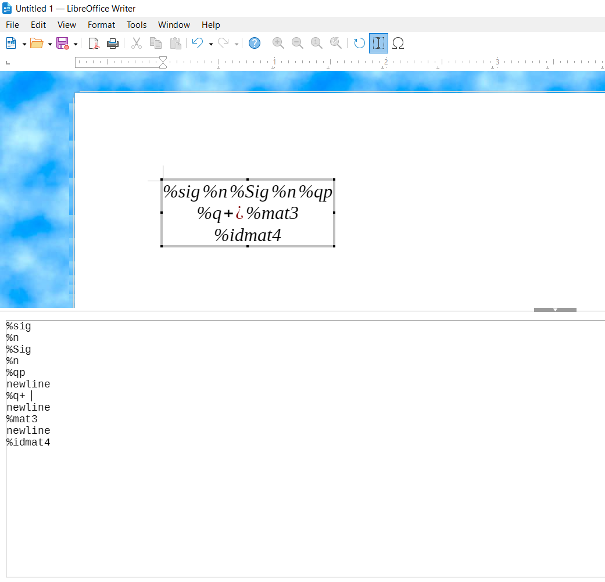
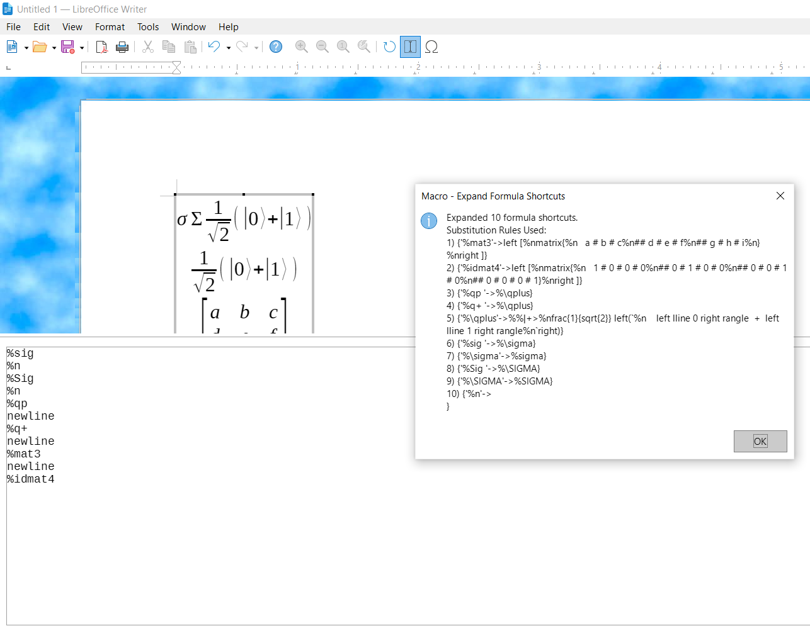
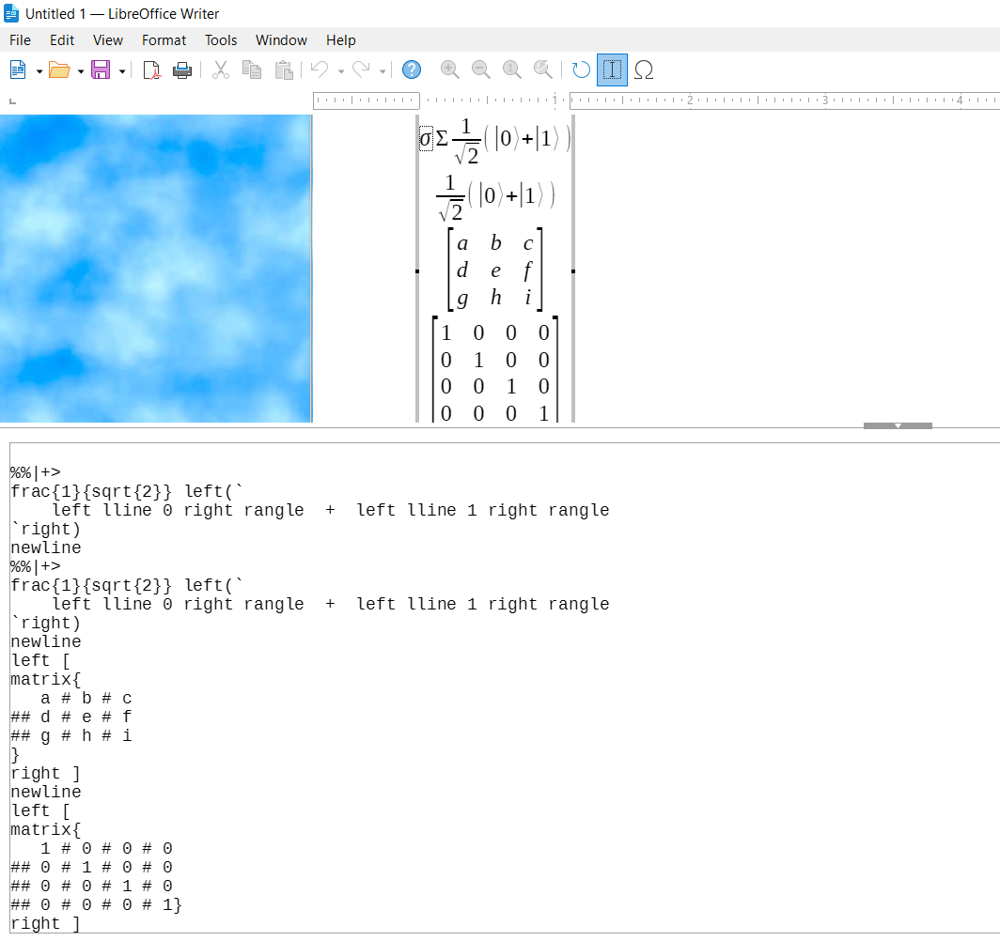
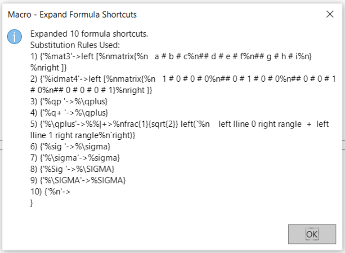

# Example of MathAutoCorrect in action

Before substituting key phrases:

<br>

During substitution of key phrases

<br>

After substituting key phrases

<br>
<br>

# Purpose of MathAutoCorrect

AutoCorrect doesn't exist when inside LibreOffice Math Formula Objects, so there is no
possibility of unofficial LO shortcuts (at least, if you do not want to have to arduously
click through the GUI to get to your user-defined formulas).
This is especially annoying with long equations.

<br>

Also, if you forget certain patterns that LO Writer already uses, this macro lets
you simply write down the shortcut to some pre-defined rule, like `%idmat2`, that contains
the native LO Writer Math Formula pattern. Example native LO Writer Math Formula patterns:
* `left [` SomeContents `right ]`
* `left [` SomeContents `right none`
* `stack{` SomeContents `}`
* `matrix{ My_row1col1 # My_row1col2 ## My_row2 }`

<br>

This macro code lets you substitute keyphrases into their expanded form when the user is
inside (not merely selecting) the Math Formula Box Editor inside a LibreOffice Writer file, 
like converting (i.e., substituting)
* `%al ` into `%alpha`
* `%the ` into `%theta`
* `%sig ` into `%sigma`
* `%Sig ` into `%SIGMA`
* `%irt2` into `frac{1}{sqrt{2}}` (for "Inverse squareRooT of 2")
* `%mat2` into 
  ```
  left [
  matrix{
     a # b
  ## c # d
  }
  right ]
  ```
* `%idmat4` into
  ```
  left [
  matrix{
     1 # 0 # 0 # 0
  ## 0 # 1 # 0 # 0
  ## 0 # 0 # 1 # 0
  ## 0 # 0 # 0 # 1}
  right ]
  ```
* `%cases2` or `%piecewise2` or `%pw2` into
  ```
  left {
    stack{a, x>0 # b, x <= 0}
  right none
  ```
* `%cases4` or `%piecewise4` or `%pw4` into
  ```
  size*0{ phantom{Piecewise Function 4} }
  stack{%theta`=` # ` # `}
  size *3.75{\lbrace}
    stack{
      {x,```i>0}
    # {y,```i=0}
    # {z,```i<0}
    # {%alpha,`i notin setR}
    # {size *2.5{~}}
    }``````
  ```
* `%deriv` into `{{df} over {dx}}`
* Many more substitutions that have already been implemented.
<br>
<br>
<br>

## File Details
⭐✅ `MathFormulaExpander.vb`
* *The* file that contains:
  * The macro to run (**"Main_ExpandFormulaShortcuts"**)
    * Should only be run after you're ***inside*** a Formula Editor.
  * The macro that details a list of available substitutions (**"ListAvailableShortcuts"**)
    * Can be run either inside the main Writer document or inside the Formula Editor.
* This is the file where you should add new rules (or modify old ones) to your liking.
* This file also includes an extra macro (**"Main_ExpandFormulaShortcutsQuiet"**) that does the exact same set of
  substitutions, but *doesn't* create a popup box informing you of the text replacements that it used, which is very
  useful once you get acquainted with how the rule-substitution system works.

❔ `MathFormulaExpander_ShortcutsTestbench.txt`
* A file that *should* (not "does", but "should") contain all the substitution
  rules that you can copy into a Formula Editor, then run the substitution macro to look for any
  unintended changes that would indicate you need to change the position or input string of a
  substitution rule.
* It is currently not fully correct, and is missing many, many tests, as is indicated inside the file itself.
* It could be useful to you, but in its current state, the idea behind the file would be far more useful to you than the file.

💤❌ `MathFormulaExpander - GetFormulaObject_Experimenting.vb` 
* Purely a development (WIP) file that contains attempts to allow substitution when the user's cursor has selected but not entered a math formula. 
  All attempts so far have been unsuccessful.
  * *Unless you are extending/improving this repository in some way* (or are a LibreOffice "employee" trying
    to see where people struggle when trying to improve LibreOffice code), ***this specific file will not be useful to you.***
<br>
<br>
<br>


# Notes/FAQ
## What does this project/macro act on, or modify?
* This *does not* substitute the visual-only representation of the Math Formula.  
* It substitutes the *actual text* inside the Math Formula (which then alters the visual representation).

## After running `ListAvailableShortcuts`, is there a fast way to get through the informational boxes of various sizes?
Yes!  
Just press `ESC` (escape) or `ENTER` (enter/return) on your keyboard for each popup box that you want to close out without having to carefully move your mouse to each of the big `X`s.
<br>
<br>

## What's the catch with this project?
With this project, the bottlenecks are:  
* Not being able to *easily* expand the list of Math shortcuts.
  * To add or modify a Math shortcut, the user either must be a programmer, be great at reading the file's documentation and interpreting it, or be relatively lucky when making changes.
  * *There is no shortcut-editing GUI*, whether in Writer or otherwise, for editing the set of shortcuts. (Maybe `LibreOffice Basic` application is an exception.)
* Laborious to set up in the first place, at least if you want easy-to-use functionality with keybinds/toolbars.
* Difficulty remembering the keybinds that map to `ListAvailableShortcuts`, `Main_ExpandFormulaShortcuts`, `Main_ExpandFormulaShortcutsQuiet`.
* Remembering to ***not*** use the other `Sub`s/`Function`s present in the macro file due to them being purely helper functions.


## Why didn't this project just make a macro that uses the pre-existing LO feature AutoText?
Note: `AutoText` is *not* to be confused with `AutoCorrect` nor `Spelling` nor `Automatic Spell Checking`.  
I haven't yet dug into these features nor explored how they can be *quickly* applied by a user in a "flow state".  
  
Also, see question that is immediately below this question.  
<br>

## Why didn't this project just make a macro that creates and imports Math Equation files?
Actually, this seems like a possible logical next step for this project - the automation of writing, modifying, and importing of Math Formula files.  

Also, see question that is immediately below this question.  
  
**Naming and Locating of Files and Folders, GUI interactions, Opening of new `LibreOffice Math` window rather than a popup**
Without further modifications, a user must use the GUI each time open a new `LibreOffice Math` window (a flow-disruptor from being in Writer), then type the full (non-shortcut) equation, then save the file (as either `.odf` or `.mml`), naming the correct file in the correct path (which may require creation of folders) to save and load, and then finding that path and file to import/load it.
* I could *instead* create a macro along with some keybinds to automatically save a highlighted selection as a `.odf`/`.mml` file or to import a `.odf`/`.mml` file via a user-provided filename and the user's cursor position inside the Formula Editor OLE Object.
  * **Con:** Searching for the correct folder that houses the equation and searching for the correct filename of the desired equation becomes a time-consuming bottleneck.
    * **Possible Fix:** A possible design choice is to **force the shortcut** (that the user types into the Formula Editor (e.g., `%mat2x2`)) **to have the same name that is given to the file** where that equation (and only that equation) is stored (e.g., `%mat2x2.odf`/`%mat2x2.mml`), since users needing to type a full filepath (or even a relative filepath!) isn't much of a *short*cut.
      * **Con:** However, this *still* makes it difficult to search for available shortcuts despite not having any nested folders of equations.
        * **Possible Fix:** Make a macro that lists every `.odt`/`.mml` filename in a new "OnlyMathFormulasGoHere" folder, where the macro could be named `ListAllAvailableMathShortcuts` (sort of) like in this project, and where the user doesn't need to specify the folder due to the macro automatically creating that "OnlyMathFormulasGoHere" folder.
<br>
<br>


## How is this project different than using User-Defined Formulas (UDF)?
**1)** UDF has no ability to subcategorize formulas created by a user, though each formula *can* be named.  
All these UDFs (and a bunch of other stuff) are stored inside just one file, `.../LibreOffice/4/user/registrymodifications.xcu`. The data inside that file cannot be edited, as the next usage of the edited file (e.g., spurred by opening a new or old Writer document) will somehow detect modifications to that file and restore a previous backup of that specific file, without even notifying the user.
* However, a user can create a new/empty Formula Editor box in Writer, then enter it, then select an already-existing UDF (after navigating the GUI for a while), then make modifications to the formula while inside the Formula Editor, then save the formula as a UDF with the exact same formula name as the UDF that the user originally picked, then accept the prompt that warns about overwriting the previous UDF, and now the UDF has successfully been modified by the user.
  * However, this does *not* affect the order of the UDF equations that get displayed to the user, and deleting a UDF and creating a new UDF that is a copy of the old UDF just puts the copied UDF at the bottom of the list of UDFs displayed to the user.    
* Unlike UDF, this project allows categorization via the `ListAvailableShortcuts` macro, even though the shortcuts themselves aren't truly categorized except by rule processing of what order to perform formula substitutions in.

**2)** UDF's GUI display of formulas cannot be reordered by the user.
The order of available UDFs displayed to the user does **NOT** rely on the alphabetical order of the names of the UDFs.  
Instead, the order of available UDFs displayed to the user relies on the ordering of the time of creation/definition of the UDFs.
* I.e., the first-to-ever-be-defined and most-recently-defined UDFs come first and last, respectively, in the list of UDFs displayed to the user in the UDF's list-of-equations GUI.  
* E.g., the ordering of formulas displayed to the user is as follows, from top to bottom:  
  OldestCreatedFormula (top), Semi-recentlyCreatedFormula, MostRecentlyCreatedFormula (bottom)  
  
The ordering of the UDFs present in `registrymodifications.xcu` (which has no effect on the ordering of formulas displayed to the user) *IS* alphabetical, but never how an average user would expect. The alphabetical ordering is implemented by sorting formula names via ASCII value, meaning that all formulas whose name starts with an uppercase letter come before all formulas whose name starts with a lowercase letter.
* E.g., the ordering of formulas present in `registrymodifications.xcu` is as follows, from top to bottom:  
  AFormula (top), BFormula, CFormula, DFormula, ZFormula, aFormula, bFormula, cFormula, dFormula, zFormula (bottom)

Without further modifications, a user must use the GUI each time to create and import a UDF, requiring mouse-cursor precision and scrolling through a likely undesirably-ordered list of UDFs.

* I could *instead* create a macro along with some keybinds to automatically save a highlighted selection as a UDF or to import a UDF via a user-provided formula name and the user's cursor position inside the Formula Editor OLE Object.
  * **Con:** Searching for/Memorizing the correct formula name becomes a time-consuming bottleneck.
<br>
<br>
<br>


## The usage guide of these macros seems like a ton of steps. Can't you do this for me with another macro?
Maybe? And if it's possible, then it won't be done anytime soon.  
I'm unsure of LO's macro permissioning in terms of the ability to:  
* Automatically create and/or modify *files* (in a nondestructive way)
* Automatically create and/or modify *LO paths and folders* (in a nondestructive way)
* Automatically create and/or modify *global LO keybinds* (in a nondestructive way)
* Automatically create and/or modify *`Writer` and `Math` Toolbars* (in a nondestructive way)  

Some interesting LO Macros that might help with these are located at:
* `LO Basic` window -> `Application Macros & Dialogs` -> `Tools` -> `Misc`
  * -> `CreateNewDocument`
  * -> `RetrieveFileName`
  * -> `OpenDocument`
  * -> `GetDocumentType`
* `LO Basic` window -> `Application Macros & Dialogs` -> `Tools` -> `ModuleControls`
  * -> `GetFolderName`
  * -> `GetFileName`
  * -> `StoreDocument`
  * -> `SetOVERWRITEToQuery`
* `LO Basic` window -> `Application Macros & Dialogs` -> `Tools` -> `UCB` -> ALL of the macros:
  * -> `ReadDirectories`
  * -> `AddFoldertoList`
  * -> `AddFileNameToList`
  * -> `RetrieveDocTitle`
  * -> `GetRealFileContent`
  * -> `ShowHelperDialog`
  * -> `SaveDataToFile`
  * -> `LoadDataFromFile`
  * -> `CreateFolder`
* `LO Basic` window -> `Application Macros & Dialogs` -> `SFWidgets`
  * -> `SF_ToolbarButton`
  * -> `SF_Toolbar`
<br>
<br>
<br>
<br>


# LO Math - Website References
### [Quick insertion of formulas - LO Books](https://books.libreoffice.org/en/GS73/GS7309-GettingStartedWithMath.html#toc66)
* This explains how to type equation text directly in Writer and then convert that equation text directly into a Math object, rather than having to open a Formula Editor.
* **Con:** You still need to manually type every character of the equation.

### [Catalog Customization - LO Books](https://books.libreoffice.org/en/GS73/GS7309-GettingStartedWithMath.html#toc77)
* `If you regularly use a symbol that is not available in Math, you can add it to the Symbols dialog by using the Edit Symbols dialog.`
  `You can add symbols to a symbol set, edit symbol sets, or modify symbol notations. You can also define new symbol sets, assign names to symbols, or modify existing symbol sets.`
* `When a new symbol is added to the catalog, you can type a percentage sign (%) followed by the new name into the markup language in the Formula Editor and your new symbol will appear in the formula. Remember that symbol names are case sensitive, for example, %prime is a different symbol to %Prime.`
* This all sounds great and perfect (i.e., it sounds like there's no need for this project), but:
  * **Con:** These are single-character symbols and therefore do not work for extensive (long) Math equations.
  * **Con:** It is laborious to pick even just one symbol from the GUIs, let alone picking dozens of them in rapid succession.
  * **Con:** At least by default, these new symbols won't work when other people open your file in LO Writer! These symbols/fonts are specific to each document! So, these symbols must be exported along with (i.e., inside) the saved document.
<br>
<br>
<br>


## Preferences: Modifying rules to obtain single-char symbol
If desired, the LO-Writer-autorecognized constants like `%SIGMA` and `%sigma` can be replaced with the
actual single-character symbols (e.g., `α`, `β`, `δ`, `Ψ`, `ψ`) by modifying this macro.

You can copy the actual unicode symbols online (or even from within Writer via the Symbols section) and either:
  * Replace the output part of the existing "sink"/"absorption"/"pointer" rules (e.g., `"%\rawtext"`, `"%\comment"`, `"%\gamma"`, `"%\qminus"`) with the desired single-character symbols.
     * E.g., changing `ReplaceShortcut(sNewFormula, "%\delta", "%delta", ...)` to `ReplaceShortcut(sNewFormula, "%\delta", "δ", ...)`).
  * Add the single-character symbols as their own rules where the "sink" rules are input and your new
  symbol rule is what it gets converted to.
     * E.g., keeping the existing `ReplaceShortcut(sNewFormula, "%\delta", "%delta", ...)` rule and making a brand new rule  `ReplaceShortcut(sNewFormula, "%delta", "δ", ...)` that immediately follows the former rule.
<br>
<br>
<br>


## ⚠️ Adding or Modifying rules
* Adding new Math AutoCorrect rules only needs to be done in one file, but that still sadly isn't as simple as the native (i.e., non-formula) AutoCorrect method.
  * In other words, instead of opening a dialog box to add a new word substitution rule (this is what regular AutoCorrect does, and only applies to regular paragraphs),
  you must open and modify this Macro code file (Math AutoCorrect - `MathFormulaExpander.vb`) (specifically the **`ReplaceAllShortcuts` Function** and **`ListAvailableShortcuts` Sub**).
* 🚨 An issue that exists regardless of whether using native AutoCorrect or this macro's format of rule substitution is that you need to be careful about *how* you add rules.
  * ⭐ The exact details of what to be wary about are detailed in the top part of the `ReplaceAllShortcuts` Function.
  * You must take care about the *order* that you create/process rules and ensuring *no accidental substitution loops* due to a substitution rule substituting a string that it just finished substituting.
    * This is the reason why:
      * Some substitutions in the file require spaces at the end of the phrases (e.g., `%sig ` instead of `%sig`)
      * Intermediate "sink" rules are used (e.g., `"%sig" -> "%/sigma" -> "%sigma"` instead of direct conversion: `"%sig" -> "%sigma"`)
      * Certain rules cannot exist at all as shortcuts due to non-determinism (ambiguity) at shorter substitution-phrase lengths.
<br>
<br>
<br>


## Naming conventions of variants of shortcuts
How should we name variants?

How do we name variants in an extensible manner, so that we can have more than just a single variant?

Let's take `%keti` as an example. What do we name a variant format/representation of the same overall concept?
* Since the regular form and the variant form 1) both refer to the same concept and 2) would be very confusing if we renamed it to a different concept, the variant doesn't merit a wholly new, unique name, but it still needs to be unique to the computer and the user who wants exactly one of the forms. I.e., deterministic processing should be preserved.
* Do we name it `%variantketi1`? `%ketiv1`? `%ketivar1`? `%varketi1`?  `%var1keti`?   `%1varketi`?    `%1vketi`?
* It should *not* be `%keti1` due to possible human misinterpretation as (or desire for it to be) `|i1>` (which is the completely different two-qubit-wide qubit-string meaning `|i>|1>`).
* `v` shouldn't be a (pseudo-)prefix. Reasoning: Ambiguous human interpretations, such as:
  * %vlen (Vector length? Variant of length? Roman-numeral-5 times the length?)
  * %vvlen (Length of nested vector? matrix length? Variant 1 of vlen? Variant 2 of len?)
* What if we assign a special following-the-%-character for each type of variant, like `@`?
  * This would create `%keti` for regular/typical usage, `%@keti` for variant 1, `%@@keti` for variant 2.
    * This is very clear to read, and doesn't create a new pattern to learn for every single shortcut that has a variant. I.e., this pattern works for all types of variants.
  * `@` shouldn't be a suffix. Reasoning: Any later searching of substitutions performed.
    * E.g., "check char2, iterate until not hitting @" vs "getStrLen, minus1, iterate backwards until not hitting @"

**This project uses** `@` **as a way to implement and use variants** for the reasons explained above.
<br>
<br>
<br>


# How to copy file `MathFormulaExpander.<ext>` into your Writer Document as a runnable Macro
## How NOT to copy it:
DO NOT *DOWNLOAD* THIS FILE AND THEN *IMPORT* IT AS A MACRO.  
**YOU MUST *COPY-PASTE*** THE FILE'S CONTENTS DIRECTLY INTO A NEW MACRO.  
* I.e., do **NOT** do `Tools`->`Macros`->`Edit Macros`  ==>  \<Deleting code scaffolding template in brand new Macro file due to non-overwriting imports\> -> `File`->`Import BASIC...`->`All Filetypes`->`MathFormulaExpander.<...>`.
* **Reasoning:** LibreOffice automatically encodes any special characters (likely for making macros *generally* safer), such as:
  * Greek letters
    * `α|0〉 + β|1〉` -> ` α|0〉 + β|1〉`
    * `{α # β # γ # δ}`	-> `{α # β # γ # δ}`
    * `ψ` -> 
  * Atypical angle brackets:
    * `|?〉` ->  ` |?〉`
    * `left lline <?> right rangle`-> `|?〉`
  * EN/EM dashes: `|–〉` -> `|–〉`
  * Partial derivative symbols: `partial` -> `∂`

## How to copy and use it properly:
### 1) **COPY (how to "save" the macro):**
* `Tools`->`Macros`->`Organize Macros`->`Basic...`  ==>
* \<new `LibreOffice Basic` application window opens\>
* Now inside the `LibreOffice Basic` window, click `Macro From` (column) ->
  * `My Macros` ->
  * `Standard` ->
  * `Module1` ->
* After you're inside the `Module1` "folder", click `New`.
* Delete the 5-6 lines of code scaffolding template in brand new Macro file.
* Paste the code you copied from `MathFormulaExpander.<...>`.
* Save the Macro with CTRL+S keybind (unless you've reconfigured that keybind).
* Exit the Macro application entirely (big red X).

### 2) **USE:** (how to use the macro):
### 2.1) Option 1: Manual
**Manually run ("execute") the macro  (laborious - *8* clicks each time you run the macro)**
* Back in the regular Writer document:
* `Tools`->`Macros`->`Run Macro...` ->
* `My Macros` -> `Standard` -> `Module1` ->
* (after inside the `Module1` "folder") `Main_ExpandFormulaShortcuts` ->
* `Run`
### 2.2) Option 2: Toolbar Button
**Make the Macro runnable by clicking a button on the Toolbar (just *1* click each time you run the macro, after doing below steps)**
NOTE: This Toolbar button will (conveniently or inconveniently) only appear when the macro is usable, which is inside the `Math`/`Formula Editor` Toolbar.
* `File`->`New`->`Formula`
  * A `LibreOffice Math` window should now be open.
* Inside the `LibreOffice Math` window, click `Tools`->`Customize...`->`Toolbars`(near the top of the popup)
* Ensure `Scope` box is set to `LibreOffice Math`.
  * *This step* is why this can't be done from inside a Writer document, requiring the extra step of entering a Math document.
  * This specific value for `Scope` is not shown when inside Writer.
* Set `Target` box to `Tools`.
* Click on the last/vertically-lowest option under the `Assigned Commands` (in the right column), ensuring it's highlighted.
* In the left column, change the `Category` selection box (above the list of entries) from `All commands` to `Macros`.
  * This step exists because the `All commands` category's listbox has an extremely large number of entries that is practically unsearchable.
* Still in the left column, inside the `Available Commands` listbox, click `My Macros` -> `Standard` -> `Module1`.
* 2.2.1) Still inside the `Module1` "folder", click ONLY ONE of whichever of `ListAvailableShortcuts`, `Main_ExpandFormulaShortcuts`, `Main_ExpandFormulaShortcutsQuiet` you would like to add to the Math toolbar.
  * Multi-selection does not exist AFAIK, so you need to do this one at a time.
* 2.2.2) Click the very large arrow that exists in between the two columns that is pointing toward the right column.
  * This adds the selected Macro function to the Math Toolbar.
  * If you accidentally added the wrong item to the Math Toolbar, that's what the very large leftward-pointing arrow (in between the two columns) is for. BUT, be careful about which item currently on the Math Toolbar is selected/highlighted.
* 2.2.3) If you want to make the item on the Math Toolbar have a shorter name than what's used in the actual Macro, then right-click on the item that is already inside the Math Toolbar, and click `Rename...`.
  * This is especially useful if your Math Toolbar is crammed with many items already and you need to save horizontal space on the Toolbar.
  * I renamed `Main_ExpandFormulaShortcuts` to `Apply_FormulaShortcuts`, but you don't have to do this.
* Repeat the previous three steps (2.2.{1,2,3}) until you have your 0-3 desired Math Toolbar shortcuts.
* Feel free to now close the `LibreOffice Math` window (press the big red X).
  * If you accidentally typed something into the Formula Editor box, LO Math will ask you whether to save when closing the file.
  * This process (specifically the entire `2.2)` section) doesn't require saving any files.
* **Now, whenever you're inside a Formula Editor (whether in Writer or Math any other LO application), you can now run the Macro (which you added to the Math Toolbar) by clicking the named button on the Math Toolbar.**
  * **This method is *not* as fast as a keybind**, but this method is still *far* faster than the main alternative (8 clicks).

### 2.3) Option 3: Keybinds (keyboard)
**Run a macro by having the user physically press a combination of keys on keyboard**  
* LO Writer -> `Tools`->`Customize...`->`Keyboard`(it's a tab near the top)->
* In the upper right side, you have two RadioButton-style options {`LibreOffice`, `Writer`}. Ensure `LibreOffice` is selected.
  * I originally picked `Writer`, which worked fine until I was inside a Formula Editor, which then was no longer executing `Writer`-only logic, meaning all the Writer-scoped keybinds no longer applied, meaning the macros no longer worked.
* Inside the `Category` listbox (in the lower left of the popup), click `Application Macros`'s little dropdown arrow (or just double-click the entry)
* Inside that, click `My Macros`->`Standard`->`Module1`
* Still inside the `Module1` "folder" in the `Category` listbox, you should now look inside the `Function` listbox.
* Click ONLY ONE of whichever of `ListAvailableShortcuts`, `Main_ExpandFormulaShortcuts`, `Main_ExpandFormulaShortcutsQuiet` you would like to run with some keybind.
* Now that the `Category` and `Function` have specific selections, look inside the `Shortcut Keys` listbox, and scroll down to the keypress-combination you want to bind to the macro you selected to run. Click on that keypress-combination, then click the `Assign` button.
  * E.g., I selected the macro `Main_ExpandFormulaShortcuts` inside the `Function` listbox. Then, inside the `Shortcut Keys` listbox, I scrolled down and clicked on the `Alt+Shift+.` (i.e., that keybind is where you simultaneously press the `ALT` *and* `SHIFT` *and* `.` keys on keyboard) row, then clicked `Assign`.
    * I also bound `Alt+Shift+L` to `ListAvailableShortcuts`, and bound `Alt+Shift+,` to `Main_ExpandFormulaShortcutsQuiet`.
<br>
<br>
<br>


# To Do ("to implement")

### Legend
* ✅: The physical task itself (not the thinking behind it) will take 30 minutes at most, usually taking 3 minutes.
* ⏳: Will take a non-negligible amount of time.
* 🧠: Requires brain cells (i.e., logical thinking of modifications affecting either the program or an average user in unintended ways, or Google/StackOverflow/Claude searches).
* Repeated symbols indicate "more" of that specific symbol (i.e., more brain cells required 🧠🧠🧠, more time required ⏳⏳⏳, speedier (more quick) to accomplish ✅✅✅).

### High Priority
* Modify rules for:
  * ✅ `"%aligneqn"` currently becomes ``"alignl stack{%na = b #%n`~= c #%n`~= d+e+f%n}"``.
    * More types of spacing characters (`` ` ``,`~`, `phantom{invisible text that takes up space in the computed formula's visual output}`) should be incorporated.
* Add shortcuts for:
  * (✅ xor ⏳⏳), 🧠🧠 `%\n` ➡️ `newline`
    * This should be put at the very end of the file, around where `%n` already is.
    * Note: The rule `%newline` ➡️ `newline` already exists.
    * I thought about swapping the association from {`%\n` ➡️ (displayed to rendered formula but textually written inside formula editor) `newline`,  `%n` ➡️ (displayed inside formula editor, not textually written anywhere) vbNewLine} to {`%n` ➡️ `newline` and `%\n` ➡️ `vbNewline`}, but it's a tradeoff between Programmers being familiar with %`\n` (for escaped newline chars in strings) and Regular people thinking `%n` is more intuitive.  I haven't decided which should be used.
  * ✅ Nullary logic operators (used when you want to get the rendered symbol, like "or" rendering as "V", but without needing inputs to the left and/or right sides of the symbol)
    * `%nullaryor`  ➡️ `` `or` ``
    * `%nullaryand` ➡️ `` `and` ``
    * `%nullarynot`, `%nullaryneg` ➡️ ``neg` ``
    * The capitalized versions as inputs, like `%nullaryNEG`
    * Note: In order to render the backticks on this README file, Github's Markdown is forcing me to add extra spaces that shouldn't exist in the actual conversions.
  * ✅ Plain-text logic operators, exponent operator (no visual change in rendered formula)
    * `%text^`   ➡️ `%dq^%dq` (`"^"`)
    * `%textor`  ➡️ `%dqor%dq` (`"or"`)
    * `%textand` ➡️ `%dqand%dq` (`"and"`)
    * `%textneg` ➡️ `%dqneg%dq` (`"neg"`)
  * ⏳ Function composition (writing execution-order-dependent functions in a linear way rather than a complicated nested way)
    * E.g., Unix pipes `|`, Scala/JS doing functional programming like `SomeInput.map(inA,inB => inA+inB).filter(...).truncate(...).reduce(...)`
    * In math: `SomeInput circ f1 circ f2 circ f3` instead of `f3(f2(f1(SomeInput)))`
    * `%fcom `, `%fcomp `, `%fcompose`, `%fncom `, `%fncomp `,`%fncompose`, `%funccomp`, `%compose`, `%composition`, `%antinest`, `%invnest`, `%fnonest`, `%fnonnest`, `%fnonnested`, `%fnotnested` ➡️ `circ`
  * ✅✅ `%veps`, `%@eps`, `%vareps ` ➡️ `%varepsilon`
  * ✅ Sparse matrices, dot sequences (vertical, horizontal, downright, downleft).
  * ✅ Magnitude/Length of vectors:
    * `%mag`, `%vlen` (for "vector length"), {`%genpyth`, `%genpythag`, `%genpythagoras`, `%genpythagorean`}, {`%genericpyth`, `%genericpythag`, `%genericpythagoras`, `%genericpythagorean`}, {`%generalpyth`, `%generalpythag`, `%generalpythagoras`, `%generalpythagorean`} ➡️ `"Length"_{"UsingAllDimensions"} = sqrt{{axis1}^2 + {axis2}^2 + {axis3}^2 + ...}`
  * Pythagorean Theorem:
    * ✅ `%pyth`,   `%pythag`,  `%pythagoras`,  `%pythagorean` ➡️ `c^2 = a^2 + b^2`
    * ✅  `%@pyth`, `%@pythag`, `%@pythagoras`, `%@pythagorean` ➡️ `c = sqrt{a^2 + b^2}`  (variant)
  * ⏳🧠 Vector overarrow (arrow over top of a variable that indicates the variable is a multi-valued vector and not a single-valued scalar):
    * `%veca`, `%vecarr`, `%vecarrow`, all meaning "vector arrow".
      * Should convert to something like `size*3{widevec{size*.2{%n  VeryLongVarName%n}}}`.
    * This should ideally compensate for `widevec`'s overarrow being stretched horizontally by an appropriate amount but it not stretching vertically, hence the ⏳.
      * Variant Naming:
        * `%veca` for the default-sized overarrow (minimal characters inside the overarrow, usually 1 to 5 characters wide)
        * `%@veca` (slightly larger-scale overarrow, meant for longer variable names)
        * `%@@veca` (even bigger)
        * `%@@@veca` (overarrow needs to span a whole page width)
  * ✅ Normalized vector:
    * {`%nvec`, `%normvec`, `%normalvec`, `%normalizedvec`, `%nrmlzdvec`}, {`%uvec`, `%unitvec`, `%unitlenvec`, `%vunitlen`, `%vecunitlen`}, {`%vlen1`, `%veclen1`, `%vlength1`, `%veclength1`} ➡️ `frac{vec}{lline vec rline}`
    * {`%@nvec`, `%@normvec`, `%@normalvec`, `%@normalizedvec`, `%@nrmlzdvec`}, {`%@uvec`, `%@unitvec`, `%@unitlenvec`, `%@vunitlen`, `%@vecunitlen`}, {`%@vlen1`, `%@veclen1`, `%@vlength1`, `%@veclength1`} ➡️ `frac{vec}{%vlen}`
  * ✅✅ Law of Sines
    * `%formulalawofsines` ➡️ ``%% Law Of Sines (relationship between angles and their corresponding opposite (physically distant) sides)%nleft lbrace%n  matrix{%n""phantom{ stack{.#.#.} }%nfrac{sin(AngleA)}{length`a}=%nfrac{sin(AngleB)}{length`b}=%nfrac{sin(AngleC)}{length`c}%n##%n""frac{length`a}{sin(AngleA)}=%nfrac{length`b}{sin(AngleB)}=%nfrac{length`c}{sin(AngleC)}%n  }%nright none``
  * ✅✅ Cosine-to-Sine Conversion `%formulacos2sin` ➡️ `""cos(x) = {sin(90-x)}_{"degrees implied"} = sin(90°-x) = sin(90" deg"_{"degrees"}-x) %\n%n""~~~~~~~= {sin({frac{%pi}{2}}-x)}_{"radians implied"} ``= sin({%pi/2" rad"_{"radians"}} - x) %\n
"Acknowledge that " %pi/2 approx frac{3.14}{2} = 1.57 " does NOT = 90. This is why the \"implied\" part is important"`
  * ⏳ Quantum gate matrix-representations (X,Y,Z,H, CX, CCX/Toffoli, SWAP, RX(theta), RY(theta), RZ(theta)).
  * ✅🧠 Quantum state *variants* where fractions are separated, for `|+>` and `|->`, `|i>` and `-|i>`.
* ✅✅✅ Hide all helper `Sub`s and `Function`s from the user executing the macro. I.e., remove the possibility that a user can run `GetFormulaObject`, `ReplaceAllShortcuts`, `ReplaceShortcuts`.
  * **INVALID FIX:** Adding `Private` in front of the `Sub`s/`Function`s to hide from the macro's executer. In reality, `Private` might only work for independent libraries or independent modules (not sure which, or if both).
* ⏳🧠🧠 Make an in-macro selection variable that determines whether symbols get fully resolved to single characters or just resolved to LibreOffice-recognized symbols. Also, implement the rule substitution functionality to make that variable useful. E.g.,
  * `SubFullyToSingleChar=False:  "%del " -> "%\delta" -> "%delta"`
  * `SubFullyToSingleChar=True:   "%del " -> "%\delta" -> "%delta" -> "δ"`
    * Do not be tempted to remove the `"%delta"` step, as it will miss all pre-existing correct symbols in the formula editor.
    * A special function could be made to allow the following situation:
      * `"%del " -> "%\delta" -> "δ"` and `"%delta" remains unchanged`
      * This would only convert the *shortcuts* to the actual symbol, *preserving* the LO-auto-recognized `"%delta"` symbol.
* ⏳🧠🧠 Add option to manually disable the verbose printing of the "sink" rules that were executed.
  * E.g., The ability to *not* show `"%/sigma" -> "%sigma"` in the dialog box after running the substitution).
  * This verbose printing should remain "enabled by default", due to its great help in debugging any unintended rule modifications.
* ⏳🧠 Add functionality to show how many times *each exact rule* was used, rather than the current functionality of merely showing an overall count of the number of substitutions performed (also has a numbered list of the types of substitutions performed).
  * 
* ⏳⏳⏳🧠🧠🧠 Look into `Edit Macros -> Application Macros & Dialogs`
  * ` -> ScriptForge -> _CodingConventions`
    * E.g., Using prefix char `p` for "parameter passed into function/sub", and data type prefix chars like `s` for string, `i` for integer, `l` for long. Mentions tons of other useful stuff too, like adding `eof` at the end of each (module?) file.
  * ` -> Tools -> Strings`
  * ` -> ScriptForge -> SF_String`
    * Contains RegEx stuff, for if I want to look into that in the far future.
  * Could be useful for saving/writing/Marshaling and loading/reading/Unmarshaling a user's MathAutoCorrect formulas to a plaintext file like `MathAutoCorrectFormulas.xml`: `%abc\tstack{Alphabetic # Consortium}\n%wat\tH_{2}O\n<EOF>`
    * `C:/Users/<NAME_OF_USER_OF_COMPUTER>/AppData/Roaming/LibreOffice/4/user/autocorr/acor_enUS.dat`, then open the `.dat` archive file using 7zip or add the file extension `.zip` to the filename.
      * Inside that zip file, the `DocumentList.xml` file contains all the autocorrect data (that which you added and that which already existed, like emoji shortcuts via colon-enclosed text like `:heart:` and regular textual shorthands (case-sensitive) that the user made like `acn't`->`can’t`).
        * Real example: `<block-list:block block-list:abbreviated-name="acn't" block-list:name="can't"/>`
    * `C:/Users/<NAME_OF_USER_OF_COMPUTER>/AppData/Roaming/LibreOffice/4/user/registrymodifications.xcu`, then open the file in a browser for easier-to-read pretty-printed XML (or use VSCode if browsers don’t work for some reason).
      * Contains stuff like:
        * Most recent destination file directory that user used to export the current document to PDF
          * Maybe useful for storing the user's user-altered path for these formulas?
          * Example: `<item oor:path="/org.openoffice.Office.Common/Misc/FilePickerLastDirectory"><node oor:name="WriterSaveAs" oor:op="replace"><prop oor:name="LastPath" oor:op="fuse"><value>file:///C:/Users/<NAME_OF_USER_OF_COMPUTER>/OneDrive%20-%20<USERNAME></value></prop></node></item>`
        * Keybinds to commands. Real examples:
          * `<item oor:path="/org.openoffice.Office.Accelerators/PrimaryKeys/Modules/org.openoffice.Office.Accelerators:Module['com.sun.star.text.TextDocument']"><node oor:name="F2" oor:op="replace"><prop oor:name="Command" oor:op="fuse"><value xml:lang="en-US">.uno:InsertObjectStarMath</value></prop></node></item>`
            * "When user presses the `F2` key on the keyboard, run inbuilt LO command InsertEditableMathEquationObject"
          * `<item oor:path="/org.openoffice.Office.Accelerators/PrimaryKeys/Modules/org.openoffice.Office.Accelerators:Module['com.sun.star.text.TextDocument']/org.openoffice.Office.Accelerators:Key['F3']/Command"><value xml:lang="en-US">.uno:AutoCorrectDlg</value></item>`
          * `<item oor:path="/org.openoffice.Office.Accelerators/PrimaryKeys/Modules/org.openoffice.Office.Accelerators:Module['com.sun.star.text.TextDocument']"><node oor:name="SPACE_MOD1" oor:op="replace"><prop oor:name="Command" oor:op="fuse"><value xml:lang="en-US">.uno:RunMacro</value></prop></node></item>`
          * `<item oor:path="/org.openoffice.Office.Accelerators/SecondaryKeys/Modules/org.openoffice.Office.Accelerators:Module['com.sun.star.text.TextDocument']"><node oor:name="EQUAL_MOD2" oor:op="replace"><prop oor:name="Command" oor:op="fuse"><value xml:lang="en-US">.uno:InsertObjectStarMath</value></prop></node></item>`
          * `<item oor:path="/org.openoffice.Office.Accelerators/SecondaryKeys/Modules/org.openoffice.Office.Accelerators:Module['com.sun.star.text.TextDocument']"><node oor:name="E_SHIFT_MOD2" oor:op="replace"><prop oor:name="Command" oor:op="fuse"><value xml:lang="en-US">.uno:InsertObjectStarMath</value></prop></node></item>`
        * Toolbars that are in/active
        * Components inside each tooolbar
          * Maybe I could add this macro to the toolbar?
        * LastTipOfTheDayID
          * Maybe I could add a `Tip of the Day` that explains how to run this macro?
          * Real Example: `<item oor:path="/org.openoffice.Office.Common/Misc"><prop oor:name="LastTipOfTheDayID" oor:op="fuse"><value>102</value></prop></item>`
        * User-made math formulas (do `CTRL`+`F` for `<item oor:path="/org.openoffice.Office.Math/User-Defined">`)
          * Real Example:
            ```
            <item oor:path="/org.openoffice.Office.Math/User-Defined"><node oor:name="mat3x3" oor:op="replace"><prop oor:name="FormulaText" oor:op="fuse"><value>size*3.5{
            [
              size*.3 matrix{
                 a # b # c
              ## d # e # f
              ## g # h # i
              ## size*.3{~} # size*.3{~} # size*.3{~}
              }
            ]
            }
            
            
            </value></prop></node></item>```
    * `C:/Program Files/LibreOffice/share/registry/math.xcd`
      * XML file that contains list of `Math` properties that LO Math can use.
      * Browser won't pretty-print this since it doesn't recognize `.xcu` as an XML file format. So, run this file through [CyberChef's `XML Beautify` recipe](https://cyberchef.org/#recipe=XML_Beautify('%5C%5Ct')) first, then save the output to a file and then open the output file in any text editor (preferably VSCode for text highlighting).
    * Inside LO Writer: `Tools` tab on toolbar -> `Options` in dropdown -> `LibreOffice` category in left sidebar -> `Paths` subcategory
      * Shows all core paths that LibreOffice uses
    * ` -> ScriptForge -> SF_TextStream`
    * ` -> Tools -> UCB`
      * CreateFolder, SaveDataToFile, LoadDataFromFile
  * Could be useful for creating a dialog box similar to Writer's native AutoCorrect module. These modules could be useful in explaining how AutoCorrect works under the hood.
    * ` -> ScriptForge -> SF_Dialog`
    * ` -> Tools -> ListBox`
    * ` -> Tools -> Misc`
    * ` -> SFDialogs -> SF_Dialog`
    * ` -> SFDialogs -> SF_DialogControl`
    * ` -> SFDialogs -> SF_DialogListener`
    * ` -> SFDocuments -> SF_Document`
    * ` -> SFDocuments -> SF_DocumentListener`
    * ` -> SFDocuments -> SF_Form`
    * ` -> SFDocuments -> SF_FormControl`
    * ` -> SFDocuments -> SF_FormDocument`
    * ` -> SFDocuments -> SF_Writer`
    * ` -> SFWidgets -> SF_Menu`
    * ` -> SFWidgets -> SF_MenuListener`
    * ` -> SFWidgets -> SF_PopupMenu`
    * Could be useful for making/adding a toolbar button that calls the MathAutoCorrect substitution macro:
      * ` -> SFWidgets -> SF_Toolbar`
      * ` -> SFWidgets -> SF_ToolbarButton`
* ⏳⏳⏳🧠🧠🧠 Creating a dialog box and shortcut-storage-file similar to Writer's native AutoCorrect module:
  * Wait, why reinvent the wheel? Just look for where Writer implemented their native AutoCorrect and see what can be copied and what needs tweaking. No idea where it is though.
    * That being said, I want to add an *option* to assign each shortcut to a user-named group rather than the default fast-to-add-and-findOrDelete-but-only-if-known functionality that native AutoCorrect has. The user should have to go slightly out of their way to press `<TAB>` to type in a group name if they want, preserving the default fast-to-add-... functionality that (both Writer's and MS Word's) native AutoCorrect has. Notably, doing this will mean that Storing/Loading will discard the current flat-file format and will (effectively) **require** some form of a tree structured format (e.g., non-flat XML), though it could be just 2 layers deep if groups are prohibited from being nested.
    * Possibilities for the grouped-rule-based data structure + searching algorithm:
        1) **Constant-pointer Constant-line-length 3-layer Inverted File structure** + search algorithm
           * 3 data storage files + codeForSearching file
           * Each row of Dictionary file: `<User-Assigned GroupName:str>      <Ptr_StartingRowInPostingsFile:int>   <#RelevantPostingsToThisGroup:int>`
           * -> Dereference `Ptr_StartingRowInPostingsFile` to get `82`, `#Releva...` has `2` -> ReadRows#82-#83InPostingsFile
           * -> (Section of Postings file:) `%comment   <Ptr_UniqueIntIDFor %\sinkRuleForComment>``\n``%annotate   <Ptr_UniqueIntIDFor %\sinkRuleForComment>`
           * -> Dereference `Ptr_UniqueIntIDFor %\sinkRuleForComment` to get `4` -> ReadRow#4InMapFile
           * -> (Section of Map file:) `%% This is a LibreOffice comment, starting with \"%%\" on the left`   
           * Slowly re-indexes entire shortcut list each time the ruleset is modified then saved.
           * Very fast to use/read (well, at least among Disk operations) due to implicit neighboring-data-in-file caching benefit and no required knowledge about *all* previous entries's byte offsets into file (which is not Random Access O(1), but rather is Linear Search: O(n)), but is still slower than the current only-one-file flat-file architecture due to this algorithm three separate-file accesses (which can take far longer than O(1) navigation to any line in the file). Is inherently built to allow saving to file on Disk.
           * HashTables can be combined with this Disk format to greatly speed up the in-RAM version of this, which is what really matters.
        2) **Linked List** data structure + search algorithm
           * Very easy to code, (*would have been*) very fast and simple to add rules to RAM (if I didn't have to first check for duplicate rules...).
           * Extremely slow to use/read rules for large #s of rules, and is inherently unparallelizable without having multiple LinkedLists at multiples of 25% record# offsets (i.e., ptrs to starts of quartiles of all records).
           * Is In-RAM-Only (can't store pointers' virtual addresses and still expect they'll be valid upon loading those addresses), but write-out to Disk is very simply iterating through the list, checking if the `<GroupName, Rule, FinalConvertedRule>`  triplet is unique, and, if that triplet is unique, then writing that triplet to a file *using some delimiter that no rule (including sink rules) nor final rule nor GroupName uses*.
             * "Some delimiter that no Shortcut/Substitution/GroupName uses" prevents a newline/comma/period/etc from being the Disk delimiter, but maybe not some other unprintable ASCII Control Characters like `<BELL>`, or heavily repeated permutation of newline/comma/period/etc, like `delim = \n.,.,`, using an extra and different delimiter for "end of line" just to be safe in case some rule ends up having a matching delimiter that causes EVERY future record to be wrongly interpreting `<GroupName, Rule, FinalConvertedRule>, <GroupName, Rule, FinalConvertedRule>` as something like ``<GroupName, WronglyConcatenated_Rule_FinalConvertedRule, GroupName>, <Rule, FinalConvertedRule, INVALID>  -> Error: `FinalConvertedRule` expected input but reached EOF, or Error: `FinalConvertedRule` has unexpected value ""``. This raises potential security vulnerability/data integrity concerns about maliciously/poorly crafted rules due to the ability to have any-length rules.
            * This is also how the file would be read back (from Disk) into RAM.
### 🤷‍♂️ (Lower Priority)
* ⏳⏳ Improve this README to detail how to set up a keybind to auto-run the macro after pressing CTRL+SPACE,
  and link to a related macro & keybind tutorial.
* ⏳⏳⏳🧠🧠 The To-Dos listed inside the Testbench file for automatically extracting the set of rules from
  `MathFormulaExpander.vb` and turning them into a Testbench file.
  * Hardcode the 1st rule as a "start testbench" sentinel and the last ("%n")
    rule as a "end testbench" sentinel to search for when creating the Testbench file, which allows ignoring all
    the actual code with the help of fixed line widths in the rules section.


<!-- Emoji list:  https://gist.github.com/rxaviers/7360908 -->
